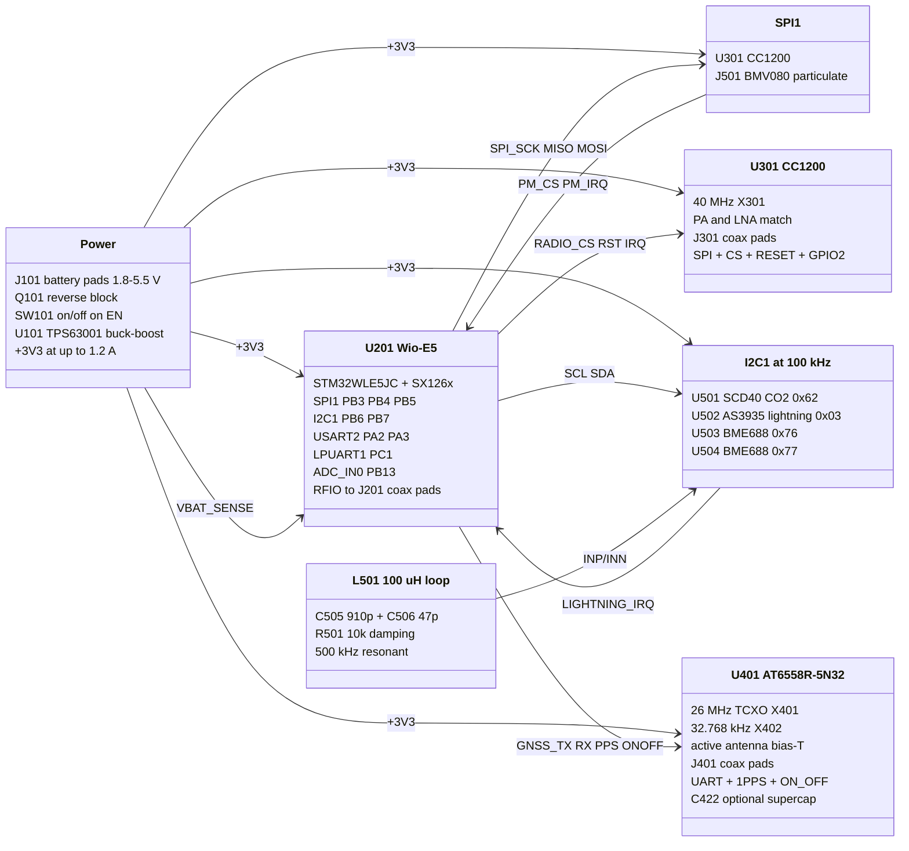
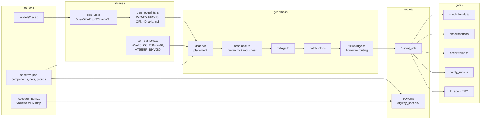

# cc1200-balloon

High altitude balloon payload: a CC1200 sub-GHz telemetry downlink and an air
quality sensor stack, hosted by a Seeed Wio-E5 module.

The CC1200 radio and its 434 MHz matching network are carried over from the
v1 design (an import of the Altus Metrum TeleMini netlist). Everything else -
the STM32F042 host, the flash, the barometer, the pyro channels, the LDO,
the comparator and the buzzer - has been removed and replaced by the Wio-E5,
a GNSS receiver and the sensor set from `Forest-Balloon.csv`.

Schematic only. There is no PCB layout yet.

## Architecture



The generator pipeline, which is what `build.sh` runs:



## Sheets

| Sheet | Contents |
| --- | --- |
| `power.kicad_sch` | battery solder pads, P-FET reverse block, SPDT switch on the regulator enable, TPS63001 buck-boost to 3V3, battery sense divider, 4 mounting holes |
| `mcu.kicad_sch` | Wio-E5 module, decoupling, reset, coax pads for the module's own LoRa radio, SWD + console pads, status LED, I2C pull-ups |
| `radio.kicad_sch` | CC1200, 40 MHz crystal, per-pin decoupling, loop filter, the v1 TX/RX matching network, coax pads |
| `gnss.kicad_sch` | AT6558R-5N32, 26 MHz TCXO, 32.768 kHz RTC crystal, internal DCDC/LDO passives, active-antenna bias-T, coax pads, optional RTC backup supercapacitor |
| `sensors.kicad_sch` | SCD40, AS3935 with its 500 kHz loop antenna, two BME688 at different addresses, BMV080 ZIF connector |

## Wio-E5 pin map

All 18 usable module GPIO are allocated. `PA13`/`PA14` are SWD, `RST` is on
the debug header.

| Pin | Net | Function |
| --- | --- | --- |
| 8 PB3 | `SPI_SCK` | SPI1 clock, CC1200 + BMV080 |
| 7 PB4 | `SPI_MISO` | SPI1 MISO |
| 11 PB5 | `SPI_MOSI` | SPI1 MOSI |
| 26 PB14 | `RADIO_CS` | CC1200 chip select |
| 5 PB15 | `RADIO_RST` | CC1200 reset |
| 20 PB10 | `RADIO_IRQ` | CC1200 GPIO2 |
| 6 PA15 | `PM_CS` | BMV080 chip select |
| 25 PB9 | `PM_IRQ` | BMV080 interrupt |
| 10 PB6 | `SCL` | I2C1 clock |
| 9 PB7 | `SDA` | I2C1 data |
| 23 PA0 | `LIGHTNING_IRQ` | AS3935 interrupt (wake-capable) |
| 19 PA2 | `GNSS_RX` | USART2 TX to the receiver |
| 18 PA3 | `GNSS_TX` | USART2 RX from the receiver |
| 27 PA10 | `GNSS_PPS` | 1PPS |
| 13 PC0 | `GNSS_ONOFF` | receiver shutdown control |
| 12 PC1 | `DBG_TX` | LPUART1 console out, on the debug header |
| 24 PB13 | `VBAT_SENSE` | ADC_IN0, 1:2 divider off the battery |
| 21 PA9 | `STATUS_LED` | green LED through 1 k |
| 15 RFIO | `LORA_RF` | u.FL, the module's own sub-GHz radio |

The CC1200's GPIO0 and GPIO3 go to test pads (`TP301`, `TP302`) rather than
to the MCU; one interrupt line is enough for normal operation and there were
no pins left.

## No connectors

The payload is mass-limited, so nothing on this board mates with anything.
Every interface is a solder pad:

| Pad | Was | Carries |
| --- | --- | --- |
| `J101` | JST-PH 2-pos | battery leads, 3.0 mm pitch, + marked in silkscreen |
| `J202` | 1x06 2.54 mm header | SWD and console, six 1.27 mm pads |
| `J301` | SMA edge launch | CC1200 coax pigtail |
| `J401` | SMA edge launch | GNSS coax pigtail |
| `J201` | u.FL receptacle | Wio-E5 LoRa coax pigtail |

That is roughly 5 g back, most of it the two SMA edge launches. The coax
pads are a centre-conductor land with coplanar grounds either side and a
braid pad behind, so a pigtail lies flat and strain-relieves on the braid
pad.

The one connector left is `J501`, the 0.30 mm ZIF that the BMV080's flex
plugs into. It weighs about 0.05 g and Bosch specifies no other way to
attach the sensor, so it stays.

## Antennas

Three RF ports, all separate, all soldered:

- `J301` - CC1200, matched for 434 MHz by the v1 network.
- `J401` - GNSS. Expects an **active** antenna: the AT6558R data sheet asks
  for 18-35 dB of external gain, and `L401`/`C401` form the bias-T that
  feeds it from `ANT_BIAS`. The BOM names an Abracon AANI-AP-0158-1, a
  27 x 27 mm adhesive patch with a 28 dB LNA and a 100 mm pigtail; cut its
  u.FL plug off and solder the coax to the pads.
- `J201` - the Wio-E5's own LoRa radio, independent of the CC1200 link.

## Optional RTC backup

`C422` is an unpopulated supercapacitor across the AT6558R's backup domain,
for GNSS hot start after a power interruption. The chip trickle-charges it
from `VDD_POR` through its own internal circuit - no diode or series
resistor needed.

**`R405` and `C422` are mutually exclusive.** `R405` (0R, fitted by
default) ties `VDD_BK` to +3V3, which keeps the backup domain alive only
while the board is powered. To use the supercapacitor, fit `C422` and
**remove `R405`**: leaving both fitted would put a 100 mF capacitor across
the 3V3 rail through zero ohms, which is a short until it charges.

The named part is a KEMET FCS0V104ZFTBR24, 100 mF at 3.5 V. That holds the
RTC and backup RAM for roughly three hours, and costs about 1 g and a
10.7 mm circle of board - which is why it is optional on a mass-limited
payload.

## Regenerating

```sh
./build.sh                 # libraries, sheets, routing, all gates, ERC, BOM
SKIP_SOURCING=1 ./build.sh # same, without the live DigiKey pass
bun run tools/gen_bom.ts   # bom.json from sheets/*.json
tools/source_bom.py --boards 1 --planned 8
```

`build.sh` is deterministic: same inputs, byte-identical schematics. Edit
`sheets/*.json`, never the generated `.kicad_sch`.

The BOM step is separate because it needs network access and spends DigiKey
API quota. It reads live stock and pricing, and will substitute an
equivalent in-stock part when the preferred one has run out - checking the
parametric value and package first, so a request for 1 uF cannot come back
as 0.1 uF.

## Verification

`build.sh` fails on any of these:

| Gate | Result |
| --- | --- |
| kicad-vis placement | 5/5 sheets placed |
| flow-wire routing | 5/5 sheets, DRC 0 violations |
| cross-sheet global labels | no undeclared names shared between sheets |
| shorted rails | no electrical group carries two power symbols |
| footprint resolution | 29 distinct footprints, all present |
| frame fit | no sheet's content runs off its page |
| netlist vs `sheets/*.json` | 388 endpoints, 77 nets, exact match |
| full-hierarchy ERC | 0 errors, 2 warnings |

The two ERC warnings are the BME688 address straps: `U503.SDO` to GND and
`U504.SDO` to +3V3 put a bidirectional pin on a power net, which is what
setting an I2C address on that part looks like.

The netlist comparison is the gate that matters. Placement and routing are
geometry, and geometry can join two rails without ERC calling it an error -
which is exactly what happened once during this design (see `NOTES.md`).

## Ordering

`digikey_bom.csv` holds **one board's worth**: 52 lines, three columns,
every line cut tape or bulk. Upload it to DigiKey's BOM Manager and set the
multiplier there rather than scaling the file - that way the pack and reel
rounding happens once, in DigiKey's hands, instead of being baked in here.

Three lines are deliberately absent from the CSV, because DigiKey cannot
fulfil them as uploaded:

- **C415, C416** (10 pF RTC load caps) - do not populate.
- **C422** (supercapacitor) - do not populate; `399-13093-1-ND` if you want it.
- **U401 AT6558R-5N32** - not stocked at DigiKey at all. LCSC C500608.

Cost is $121.64 per board, of which $45 is off-board (the BMV080 module and
the GNSS antenna). Checked against an 8-board run, two lines are tight:
the BMV080 comes in packs of 10 and is discontinued at DigiKey, and the
56 nH match inductor has 59 in stock against the 16 the run needs.

## Known limitations

- **GNSS altitude limit.** The AT6558R data sheet says nothing about COCOM
  limits. Most consumer receivers stop reporting above 18 km or 515 m/s,
  which is below balloon float altitude. Confirm the firmware's behaviour
  before flying, or plan on a receiver with an explicit airborne mode.
- **BMV080 mating connector.** The land pattern for the 0.30 mm pitch
  KYOCERA 6844 connector was derived from the series drawing, not from a
  vendor-supplied library. Check it against Kyocera's own recommendation
  before fabrication.
- **SCD40 in a balloon.** The sensor is specified from -10 C and its NDIR
  reading is pressure-dependent; at float altitude both are out of range
  without compensation from the BME688 pressure channel.
- No PCB layout, no thermal design, no antenna measurements.
