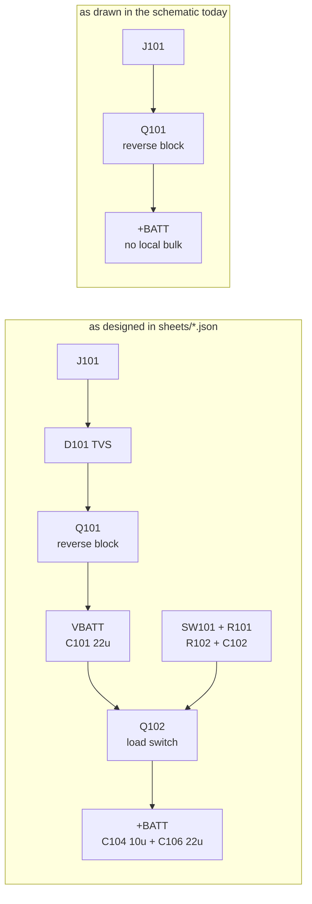

# Schematic review: cc1200-balloon

Reviewed at commit `0d6f3e7` ("Clean up schematic. Add component groups to PCB.").
Reference design for the CC1200 supply work: `~/telemini/` (Altus Metrum TeleMini 3.0a).

## Verdict

Two blocking defects, both introduced by the hand-edit in `0d6f3e7`:

1. **The Power sheet has been emptied.** Ten parts were deleted, including the
   on/off switch and the entire load-switch path. The board has no way to be
   turned off and no bulk capacitance at the load.
2. **`SCL` and `SDA` are swapped at all four I2C devices.** The bus cannot work
   as drawn.

Everything else checks out. Outside those two faults the schematic is an exact
electrical match to `sheets/*.json`, the CC1200 support circuitry and the
434 MHz match reproduce TeleMini component-for-component, and the AT6558R
wiring matches the data sheet in `ref/`.

The PCB has **zero routed traces**, so fixing both costs no layout rework.

## Method

- Exported the flat netlist from the current `.kicad_sch` set with
  `kicad-cli sch export netlist` (107 components, 92 nets).
- Compared the resulting pin-to-net partition against `sheets/*.json`, the
  generator's source of truth, normalising the pin numbering of two-pin
  passives so that a flipped capacitor does not read as a difference.
- Cross-checked the CC1200 support parts and the RF match against the TeleMini
  netlist, and its capacitor placement against `telemini.pcb` element geometry.
- Checked the AT6558R against `ref/AT6558R-5N32.pdf` (pin table section 2.2,
  power scheme 3.2, reference design 7.1, BOM 7.2).
- Parsed `cc1200_balloon.kicad_pcb` and confirmed its net assignments match the
  schematic exactly, then measured every CC1200 support part's pad-to-pin
  distance.

Full-hierarchy ERC reports **0 violations**. Neither defect below is the kind
ERC can see: a swapped pair of same-type pins and a deleted subcircuit both
leave a perfectly legal schematic.

---

## 1. The Power sheet is empty (blocking)

`power.kicad_sch` is a 301-byte stub with no components. Some of its parts
migrated into `mcu.kicad_sch`; the rest were deleted outright.

| Ref | Value | Function | Status |
| --- | --- | --- | --- |
| `J101` | BATT pads | battery input | moved to MCU sheet |
| `Q101` | DMG3401LSN-7 | reverse-block P-FET | moved to MCU sheet |
| `R103` `R104` `C107` | 100k 100k 100n | battery sense divider | moved to MCU sheet |
| `H101`-`H104` | M2.5 | mounting holes | moved to MCU sheet |
| `D101` | SMF6.5A | input TVS | **deleted** |
| `C101` | 22u | `VBATT` bulk | **deleted** |
| `SW101` | JS102011SAQN | on/off switch | **deleted** |
| `Q102` | DMG3401LSN-7 | load switch P-FET | **deleted** |
| `R101` `R102` `C102` | 100k 10k 1u | gate bias and soft start | **deleted** |
| `C104` `C106` | 10u 22u | `+BATT` bulk | **deleted** |
| `C203` | 10u | Wio-E5 bulk (MCU sheet) | **deleted** |

Consequences:

- **No power switch.** The board is live whenever the cell is connected.
- **No soft start.** The `R102`/`C102` ramp that held inrush to ~30 mA is gone.
- **No input TVS.**
- **`VBATT` and `+BATT` have merged.** `Q101` source now feeds `+BATT`
  directly. Reverse-battery protection survives — that was `Q101`'s job — but
  it is now the only thing between the cell and the whole board.
- **The rail lost 42 uF of its 76 uF.** `+BATT` is down to 34 uF, and 22 uF of
  that is `C502` at the SCD40, 13.6 mm away from the CC1200. The radio's own
  local bulk is `C312`, a single 1 uF at 5.2 mm. That is thin for a part that
  pulls ~120 mA in TX bursts from a bobbin cell with ohms of internal
  resistance — the exact brownout loop `README.md` describes.

**Fix.** Restore the deleted parts. `sheets/power.json` still holds the correct
netlist for all of them, so the content is not lost — see section 5 for how to
get it back without losing the PCB work.

---

## 2. SCL and SDA are swapped at every I2C device (blocking)

The MCU end is right and all four device ends are wrong, so the clock line
lands on the sensors' data pins and vice versa.

| Net as drawn | MCU | SCD40 `U501` | AS3935 `U502` | BME688 `U503`/`U504` |
| --- | --- | --- | --- | --- |
| `SCL` | pin 10 `PB6` — clock, correct | pin 10 **SDA** | pin 13 **MOSI/SDA** | pin 3 **SDI** |
| `SDA` | pin 9 `PB7` — data, correct | pin 9 **SCL** | pin 11 **SCL** | pin 4 **SCK** |

`sheets/sensors.json` has it right (`SCL` to `U501.9 U502.11 U503.4 U504.4`),
so this is a regression introduced when the sheet was edited by hand, not a
source error. The pull-ups `R203`/`R204` follow the swapped nets, so both lines
are still pulled up — nothing else masks it.

**Fix.** The whole error is two global labels in `sensors.kicad_sch`:

- `SDA` at `328.93, 269.24`
- `SCL` at `328.93, 274.32`

Swapping those two label texts corrects all four devices at once. The board
carries the same swap (PCB nets match the schematic exactly), so re-import the
netlist afterwards — with no traces routed, nothing else has to move.

---

## 3. Everything else verified correct

These were checked against a reference and found sound; no action needed.

**CC1200 `U301`** — all 33 pins match the data sheet function assignment and
the TeleMini wiring: supplies on pins 1/5/12/13/15/22/25/27/28, the four
internal-regulator decoupling pins 6/21/26/29, `RBIAS` 56k on pin 14, the
1.8 nF loop filter across LPF0/LPF1 (23/24), `EXT_XOSC` (32) grounded for
crystal operation, and the exposed pad on GND.

**434 MHz match** — reproduces TeleMini node for node, including the two easy
things to get wrong: `C322` 2p2 sits in *parallel* with `L302` 15n (TeleMini
`C176` across `L172`), and `L307` 27n shunts LNA_P to ground while `L308` 27n
returns LNA_N to the RX node. All sixteen values carry over unchanged.

**AT6558R `U401`** — matches `ref/AT6558R-5N32.pdf` throughout. `VDD_IO` (7)
and `DX_IN` (21) on the rail; `VCORE` (23) fed from `DX_OUT` (22) through
`L403`; the LDO output pins each decoupled to the value the pin table names
(`VDD_ANA` 1 uF, `VX_OUT` 0.1 uF); `TEST` (29) pulled low and `ON_OFF` (30)
driven, both as specified; `nRST` (17), `GPIO8` (8) and `GPIO16` (33) left
floating, which is what the data sheet requires. The 32.768 kHz crystal
correctly has no load caps. `ANT_BIAS` uses the 33 nH + 0.1 uF feed the data
sheet names.

**UART crossing** — `PA2` (USART2 TX) reaches `GPIO1/RXD0`, `PA3` (USART2 RX)
reaches `GPIO0/TXD0`, each through the 22R the reference design shows. Correct
in the direction that is usually wrong.

**I2C addressing** — AS3935 `AD0`/`AD1` both high gives 0x03; BME688 `SDO` low
gives 0x76 and high gives 0x77; both BME688 `CSB` pins high select I2C. All
match `README.md`.

**Interrupts** — `PA0`, `PB9`, `PB10` use EXTI lines 0, 9 and 10. No two
interrupt sources share a line.

**Status LED** — `D201` cathode to GND, anode through `R202` 1k to `PA9`.
Correct polarity for a high-side drive.

---

## 4. Worth confirming before fabrication

Three items I could not settle from material on this machine.

**AS3935 regulator configuration.** `Vdd` (5) and `VReg` (6) are both tied to
`+BATT` with `EN` (7) grounded — the "internal regulator bypassed" arrangement,
which the ams application circuits specify for a *regulated 2.5 V* supply, not
for a rail that reaches 3.6 V. There is no AS3935 data sheet in `ref/` and
`NOTES.md` does not record the reasoning. Check whether this part wants
`EN_VREG` tied high on an unregulated rail. Separately, `C503` (10u) sits on
`ACG` (1) rather than on `VReg`; confirm that is where the data sheet wants it.

**CC1200 crystal load caps.** `C318`/`C319` are 12p against TeleMini's 10p, and
the crystal changed with them (`CX3225SB40000D0FPLCC` here, an ABM12 in
TeleMini). `NOTES.md` says the load caps were "kept from v1", which is not
quite what happened. Size them from the chosen crystal's CL: with ~3 pF of
stray, 12 pF caps present about 9 pF, so they suit a CL=9 pF part and pull a
CL=8 pF part low.

**`BOM.md` is stale.** It lists `C402` as 1u and `C411` as 10u, and references
`C417`-`C419`, none of which match `sheets/gnss.json` today. Regenerate before
ordering.

---

## 5. CC1200 supply decoupling: which capacitor goes at which pin

This is the layout list. The schematic puts all nine 47 nF caps on one `+BATT`
net with no pin association, so the assignment has to be made here and carried
into placement by hand.

`U301` is a QFN-32, 5x5 mm, 0.5 mm pitch, at `90.0, 108.65` rotated -90 deg on
`F.Cu`. Pin coordinates below are the board coordinates as placed today.

### The nine rail capacitors — one per supply pin

Assignment follows refdes order against pin order, which is how `NOTES.md`
describes the intent ("the nine supply decoupling caps"):

| Cap | Value | Pin | Function | Pad at | Package edge |
| --- | --- | --- | --- | --- | --- |
| `C301` | 47n | 1 | `VDD_GUARD` | `91.75, 106.21` | top |
| `C302` | 47n | 5 | `DVDD` | `89.75, 106.21` | top |
| `C303` | 47n | 12 | `DVDD` | `87.56, 108.40` | left |
| `C304` | 47n | 13 | `AVDD_IF` | `87.56, 108.90` | left |
| `C305` | 47n | 15 | `AVDD_RF` | `87.56, 109.90` | left |
| `C306` | 47n | 22 | `AVDD_SYNTH1` | `90.75, 111.09` | bottom |
| `C307` | 47n | 25 | `AVDD_PFD_CHP` | `92.44, 110.40` | right |
| `C308` | 47n | 27 | `AVDD_SYNTH2` | `92.44, 109.40` | right |
| `C309` | 47n | 28 | `AVDD_XOSC` | `92.44, 108.90` | right |

Each one goes on the same layer as the part, hot pad facing its supply pin,
ground pad onto the ground pour with its own via — never daisy-chained through
a neighbour's via. The nine pins sit on all four edges of the package, so the
caps must ring it. TeleMini achieved 0.8-2.2 mm pad-to-pin; treat 2 mm as the
ceiling.

TeleMini used seven 47 nF for these nine pins, letting one cap serve pins 27
and 28 and another serve 12 and 13. This design has nine, one each, which is
the better arrangement — keep it.

### The four internal-regulator capacitors — closest of all

These decouple regulators *inside* the chip. They are not on the rail, and they
matter more than the nine above.

| Cap | Value | Pin | Function | Pad at | TeleMini equivalent |
| --- | --- | --- | --- | --- | --- |
| `C313` | 220n | 6 | `DCPL` | `89.25, 106.21` | `C42` 0.22uF |
| `C314` | 10n | 21 | `DCPL_VCO` | `90.25, 111.09` | `C211` 0.01uF |
| `C315` | 47n | 26 | `DCPL_PFD_CHP` | `92.44, 109.90` | `C261` 47nF |
| `C316` | 47n | 29 | `DCPL_XOSC` | `92.44, 108.40` | `C291` 47nF |

`C314` on `DCPL_VCO` is the one to place first — it is the VCO's supply and it
sits on the bottom edge between the LNA pins and `AVDD_SYNTH1`, which is
crowded. TeleMini got all four to 2.0-3.4 mm.

### Rail-level capacitors — not per-pin

| Cap | Value | Where it goes |
| --- | --- | --- |
| `C312` | 1u | bulk, where `+BATT` enters the radio block, ahead of the ring of 47n |
| `C311` | 10n | with `C312`, or near `AVDD_RF` (pin 15) — TeleMini's `C171` was closest to that pin |
| `C310` | 100p | near `AVDD_RF` (pin 15) — TeleMini's `C172`, the fastest cap in the set |

**`C320` (56p) is not a decoupling capacitor.** It sits in parallel with `R302`
18R across the PA bias feed, exactly as TeleMini's `C173` parallels `R171`.
Place it beside `R302`, not at a chip pin.

### Also close to their pins

`C317` 1n8 straddles pins 23/24 with the shortest possible loop; `C318`/`C319`
and `X301` form the 40 MHz oscillator at pins 30/31; `R301` 56k sits at pin 14.

### What the current PCB does

All twelve rail capacitors are bunched off the top edge of the package, and the
four regulator capacitors are 6-11 mm away:

| Part | Should be at | Nearest supply pin today | Distance |
| --- | --- | --- | --- |
| `C301`-`C309` | ringing the package | pins 1 and 5 only, all nine | 2.1-4.8 mm |
| `C310` `C311` `C312` | rail entry / pin 15 | pins 1 and 5 | 4.6-5.3 mm |
| `C313` | pin 6 | — | 6.2 mm |
| `C314` | pin 21 | — | 11.1 mm |
| `C315` | pin 26 | — | 9.7 mm |
| `C316` | pin 29 | — | 10.0 mm |

Nothing is placed on the left, bottom or right edges. Pins 12, 13, 15, 22, 25,
27 and 28 have no capacitor near them at all. This needs redoing before the
board is routed.

Better already: `R301` at 1.4 mm, `C319` at 1.4 mm, `C318` at 1.9 mm, `C317` at
1.7-2.0 mm, `C325` at 1.9 mm. The TX chain is loose — `L301` 5.4 mm and `C321`
6.2 mm from pin 17 — and should be tightened while the decoupling is moved.

---

## 6. Suggested order of work

1. Swap the two global labels in `sensors.kicad_sch` — smallest fix, largest
   consequence.
2. Restore the power section. `sheets/power.json` is intact, so the cleanest
   route is to regenerate `power.kicad_sch` alone rather than running
   `build.sh`, which rewrites all five sheets and would discard the rest of the
   hand-editing in `0d6f3e7`. Restore `C203` on the MCU sheet at the same time.
3. Re-import the netlist into the PCB and place the restored parts.
4. Redo the CC1200 decoupling placement per section 5 before routing.
5. Resolve the three items in section 4.
6. Regenerate `BOM.md`.

### A note on the generator

`sheets/*.json` and the `.kicad_sch` files have diverged: the schematics are
now hand-edited and the JSON is not. `build.sh` regenerates all five sheets
from the JSON unconditionally, so running it restores the power section and the
correct I2C wiring but discards every other change made in `0d6f3e7`. Decide
which direction is authoritative before running it. (`assemble.ts` merges into
`.kicad_pro` rather than overwriting it, so the ERC pin map and severities
configured in the GUI are safe either way.)
